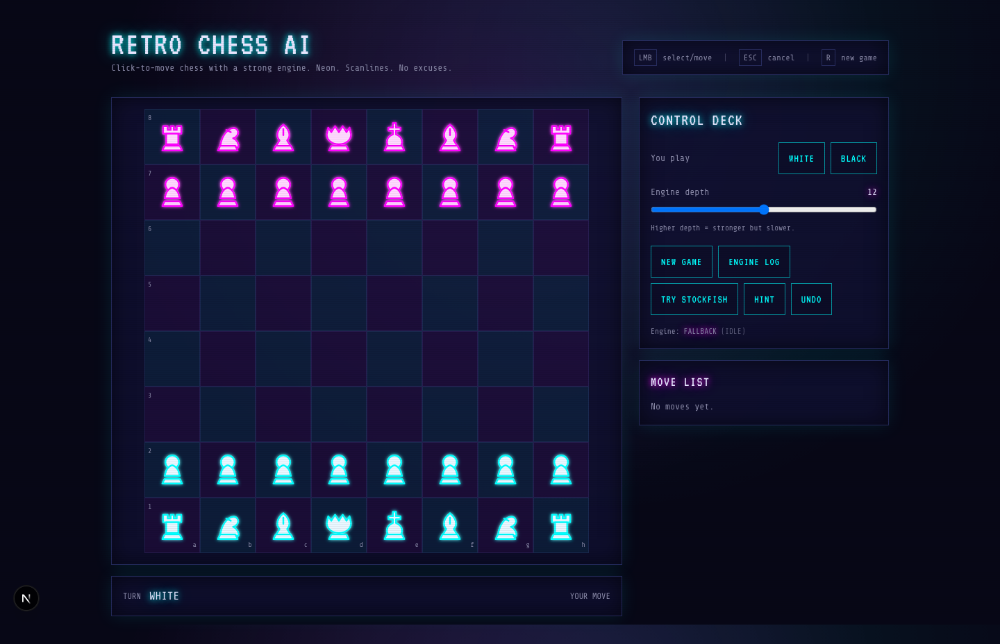

# Retro Chess AI

Retro Chess AI is a synthwave/retro chess web app (Next.js) where you play against an AI.



## Features

- Click-to-move chessboard (legal moves via `chess.js`)
- Synthwave UI (scanlines/noise/neon)
- Readable retro pieces (SVG silhouettes)
- AI:
  - **Fallback AI** (always works, instant startup)
  - Optional **Stockfish** attempt (WebWorker + WASM) via `TRY STOCKFISH`
- Move list, undo, hint, promotion picker

## Run locally

```bash
cd retro-chess-ai
npm install
npm run dev
```

Open `http://localhost:3000` (or whatever port Next prints).

## Controls

- Left click: select/move
- `ESC`: cancel selection
- `R`: new game

## AI / Engine notes

The app defaults to **Fallback AI** so it’s playable on every browser immediately.
If you want Stockfish, click `TRY STOCKFISH`. If your browser blocks Worker/WASM for any reason, the game still runs with the fallback engine.

## Build

```bash
npm run build
npm run start
```

## German README

See `README.de.md`.

## Getting Started

First, run the development server:

```bash
npm run dev
# or
yarn dev
# or
pnpm dev
# or
bun dev
```

Open [http://localhost:3000](http://localhost:3000) with your browser to see the result.

You can start editing the page by modifying `app/page.tsx`. The page auto-updates as you edit the file.

This project uses [`next/font`](https://nextjs.org/docs/app/building-your-application/optimizing/fonts) to automatically optimize and load [Geist](https://vercel.com/font), a new font family for Vercel.

## Learn More

To learn more about Next.js, take a look at the following resources:

- [Next.js Documentation](https://nextjs.org/docs) - learn about Next.js features and API.
- [Learn Next.js](https://nextjs.org/learn) - an interactive Next.js tutorial.

You can check out [the Next.js GitHub repository](https://github.com/vercel/next.js) - your feedback and contributions are welcome!

## Deploy on Vercel

The easiest way to deploy your Next.js app is to use the [Vercel Platform](https://vercel.com/new?utm_medium=default-template&filter=next.js&utm_source=create-next-app&utm_campaign=create-next-app-readme) from the creators of Next.js.

Check out our [Next.js deployment documentation](https://nextjs.org/docs/app/building-your-application/deploying) for more details.
